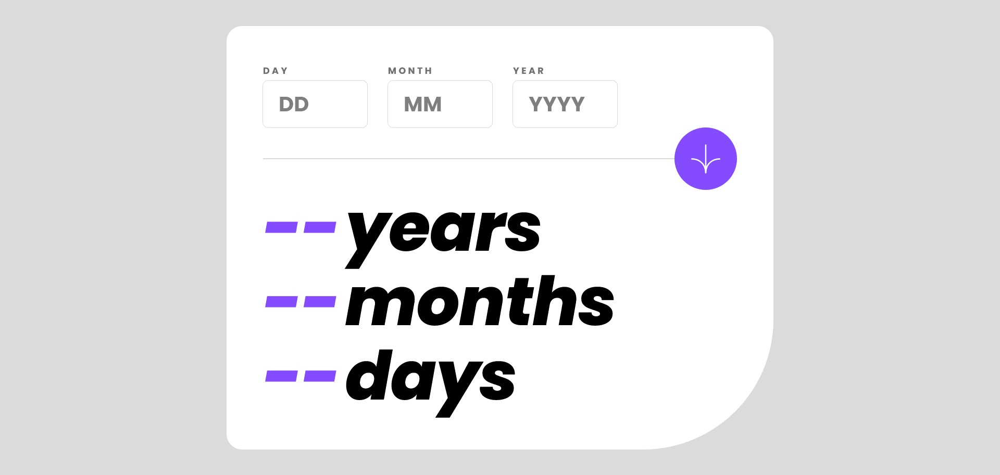

# Frontend Mentor - Age calculator app solution

This is a solution to the [Age calculator app challenge on Frontend Mentor](https://www.frontendmentor.io/challenges/age-calculator-app-dF9DFFpj-Q). Frontend Mentor challenges help you improve your coding skills by building realistic projects. 

## Table of contents

- [Overview](#overview)
  - [The challenge](#the-challenge)
  - [Screenshot](#screenshot)
  - [Links](#links)
- [My process](#my-process)
  - [Built with](#built-with)
- [Author](#author)

## Overview

### The challenge

Users should be able to:

- Select a quiz subject
- Select a single answer from each question from a choice of four
- See an error message when trying to submit an answer without making a selection
- See if they have made a correct or incorrect choice when they submit an answer
- Move on to the next question after seeing the question result
- See a completed state with the score after the final question
- Play again to choose another subject
- View the optimal layout for the interface depending on their device's screen size
- See hover and focus states for all interactive elements on the page
- Navigate the entire app only using their keyboard
- **Bonus**: Change the app's theme between light and dark

### Screenshot

### Links

- Solution URL: [https://www.frontendmentor.io/solutions/age-calculator-app-react-4Y1qwmm-Hv]
- Live Site URL: [https://d-sisovic.github.io/Age-Calculator-App/]

## My process

### Built with

- Semantic HTML5 markup
- CSS custom properties
- SCSS
- Flexbox
- Mobile-first workflow
- [React](https://reactjs.org/) - JS library
- [React Testing Library](https://testing-library.com/docs/react-testing-library/intro/) - Testing library

## Author
